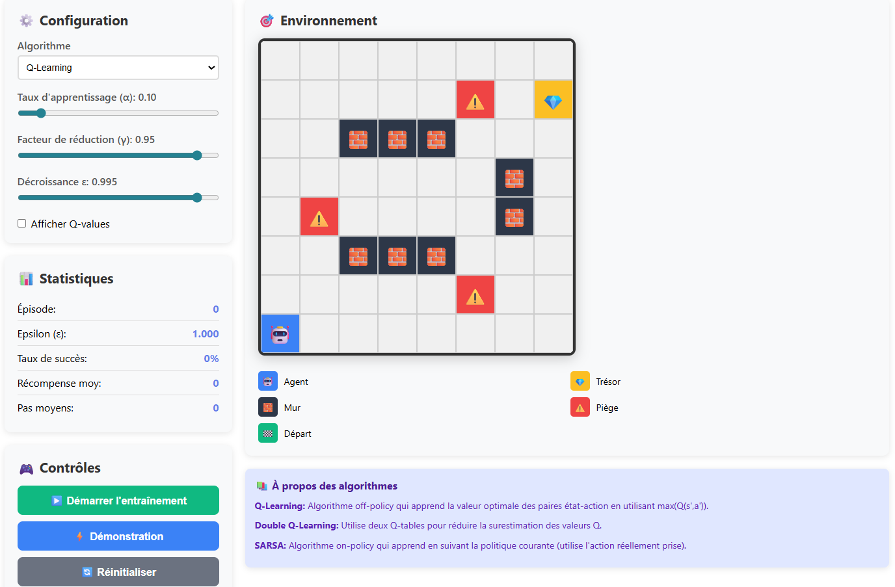
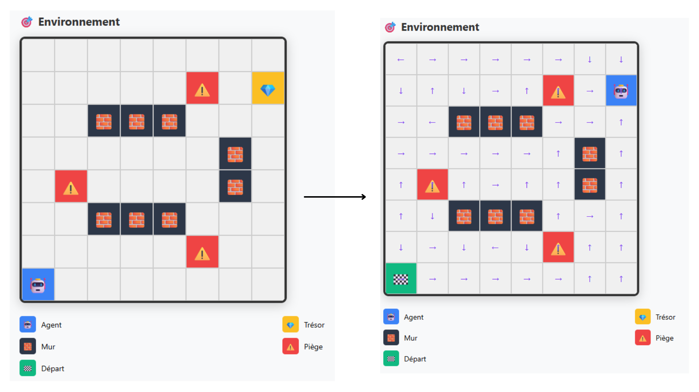

# 🧠 Apprentissage par Renforcement - Jeu du Trésor

Application web interactive pour visualiser et comparer différents algorithmes d'apprentissage par renforcement (Q-Learning, Double Q-Learning, SARSA).

## 📁 Architecture du Projet
```
RLWeb/
├── app.py              # Point d'entrée Flask
├── environment.py      # Logique de la grille
├── agent.py            # Logique de l'agent RL
├── algorithms.py       # Q-Learning, Double Q-Learning, SARSA
├── trainer.py          # Entraînement de l'agent
├── templates/
│   └── index.html      # Interface utilisateur (HTML)
├── static/
│   ├── style.css       # Styles CSS
│   └── script.js       # Logique front-end (JavaScript)
└── README.md           # Documentation
```
## 🖼️ Interface de l’application



## 🤖 Mode démonstration




## 🎥 Démonstration vidéo

👉 [Cliquez ici pour voir la démonstration](Projet_Rl_Demo.mp4)


## 🚀 Installation

### Prérequis
- Python 3.8+
- pip

### Étapes

1. **Cloner le repository**
```bash
git clone <[votre-repo](https://github.com/CherniNada12/Rl_Project.git)>
cd RLWeb
```

2. **Créer un environnement virtuel**
```bash
python -m venv venv
source venv/bin/activate  # Sur Windows: venv\Scripts\activate
```

3. **Installer les dépendances**
```bash
pip install flask numpy
```

4. **Lancer l'application**
```bash
python app.py
```

5. **Accéder à l'application**
Ouvrir votre navigateur à l'adresse : `http://localhost:5000`

## 📚 Modules

### `environment.py`
Gère l'environnement de la grille :
- Création de la grille avec obstacles, pièges et trésor
- Calcul des récompenses
- Vérification des états terminaux

### `agent.py`
Implémente l'agent d'apprentissage :
- Gestion des Q-tables (simple et double)
- Politique epsilon-greedy
- Calcul des transitions d'état

### `algorithms.py`
Contient les algorithmes d'apprentissage :
- **Q-Learning** : Algorithme off-policy
- **Double Q-Learning** : Réduit la surestimation des valeurs Q
- **SARSA** : Algorithme on-policy

### `trainer.py`
Gère le processus d'entraînement :
- Exécution des épisodes
- Collecte des statistiques
- Démonstration de l'agent entraîné

### `app.py`
Serveur Flask avec les endpoints API :
- `/` : Page principale
- `/train` : Entraîner un épisode
- `/reset` : Réinitialiser l'agent
- `/demonstrate` : Démonstration du chemin optimal

## 🎮 Utilisation

1. **Choisir un algorithme** : Q-Learning, Double Q-Learning ou SARSA
2. **Ajuster les paramètres** :
   - α (alpha) : Taux d'apprentissage
   - γ (gamma) : Facteur de réduction
   - ε decay : Décroissance epsilon
3. **Démarrer l'entraînement** : Observer l'agent apprendre
4. **Démonstration** : Voir le chemin optimal trouvé
5. **Réinitialiser** : Recommencer l'entraînement

## 🎯 Fonctionnalités

- ✅ 3 algorithmes d'apprentissage par renforcement
- ✅ Visualisation en temps réel de l'entraînement
- ✅ Statistiques détaillées (taux de succès, récompense moyenne, etc.)
- ✅ Affichage des Q-values sur la grille
- ✅ Mode démonstration pour voir le chemin optimal
- ✅ Interface responsive et intuitive

## 📊 Environnement

La grille 8×8 contient :
- 🤖 **Agent** : Position de départ (0, 7)
- 💎 **Trésor** : Objectif à atteindre (+100 points)
- 🧱 **Murs** : Obstacles infranchissables (-10 points)
- ⚠️ **Pièges** : Zones dangereuses (-50 points)
- 🏁 **Départ** : Case de départ

## 🔧 Technologies Utilisées

- **Backend** : Flask (Python)
- **Frontend** : HTML5, CSS3, JavaScript
- **ML** : NumPy (calculs matriciels)
- **Algorithmes** : Q-Learning, Double Q-Learning, SARSA

## 🧠 Algorithmes implémentés

### 🔹 Q-Learning (off-policy)

Le Q-Learning apprend la politique optimale indépendamment de la politique suivie par l’agent.

**Équation de mise à jour :**
Q(s,a) ← Q(s,a) + α [ r + γ maxₐ′ Q(s′,a′) − Q(s,a) ]


### 🔹 Double Q-Learning (off-policy)

Le Double Q-Learning est une amélioration du Q-Learning classique visant à réduire la surestimation des valeurs Q.

**Équation de mise à jour :**
Q1(s,a) ← Q1(s,a) + α [ r + γ Q2(s′, argmax Q1(s′,a′)) − Q1(s,a) ]
Q2(s,a) ← Q2(s,a) + α [ r + γ Q1(s′, argmax Q2(s′,a′)) − Q2(s,a) ]

### 🔹  SARSA (on-policy)

SARSA (State–Action–Reward–State–Action) est un algorithme on-policy qui apprend la valeur des actions réellement suivies par la politique courante.

**Équation de mise à jour :**
Q(s,a) ← Q(s,a) + α [ r + γ Q(s′,a′) − Q(s,a) ]

## 📊 Tableau comparatif des algorithmes d’apprentissage par renforcement

| Critère | **Q-Learning** | **Double Q-Learning** | **SARSA** |
|--------|---------------|----------------------|-----------|
| **Type** | Off-policy | Off-policy | On-policy |
| **Idée clé** | Apprend via la meilleure action possible | Réduit la surestimation avec deux tables Q | Apprend selon la politique suivie |
| **Mise à jour** | `max Q(s′,a′)` | `Q1 / Q2 alternées` | `Q(s′,a′)` |
| **Surestimation** | Élevée ⚠️ | Faible ✅ | Faible ✅ |
| **Stabilité** | Moyenne | Élevée | Élevée |
| **Convergence** | Rapide | Moyenne | Plus lente |
| **Comportement** | Risqué | Équilibré | Prudent |
| **Mémoire** | 1 table Q | 2 tables Q | 1 table Q |
| **Résultat (Jeu du Trésor)** | Rapide mais instable | Stable et fiable | Sûr mais plus long |


## 👨‍💻 Auteur

Nada Cherni & Maysen Chiha 

